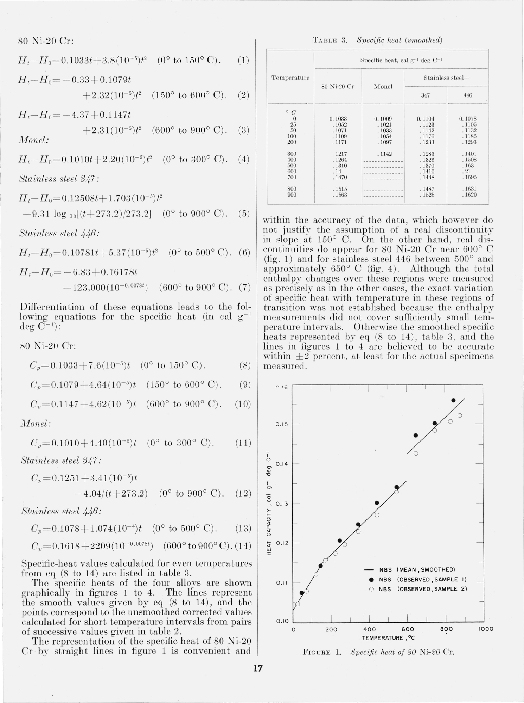
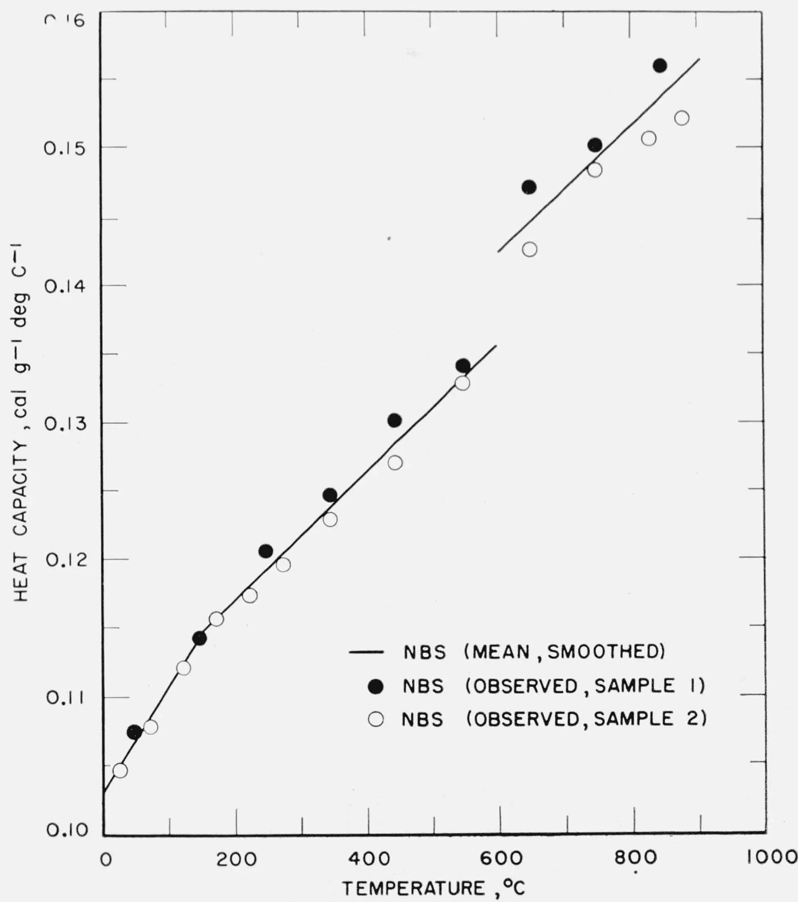

# techbookocr

techbookocr turns scanned technical books into Markdown on your own machine. It was built for old metallurgy and foundry handbooks: pages dense with tables, formulas, alloy grades, and drawings inside table cells. Nothing leaves the computer; every model runs locally on one 12 GB GPU.

Input is a `.djvu` or `.pdf` file (Russian, English, or German). Output is a Markdown book with:

- tables as HTML, keeping `rowspan` and `colspan` for merged header cells;
- formulas in LaTeX;
- figures cropped to WebP files and linked from the text, including drawings that sit inside table cells (placed into the cell as ``);
- footnotes as `[^n]`, and a page anchor such as `<!-- page: 39 scan: 0018R -->` before every page, so you can always find the source page;
- a `quality.md` report that lists every misprint the pipeline corrected (old text and new text), the corrections it refused, every block that failed, and every word the spell checker did not know.

The result works as a source for retrieval (RAG) and also as an Obsidian vault: each book gets YAML front matter and a table-of-contents note.

## Example

The input below is page 17 of a 1955 paper from the U.S. National Bureau of Standards (Douglas and Dever, J. Res. NBS 54, RP2560), which is in the public domain. It has fourteen equations, a table with a two-level header, and a plot. The full output is in [`examples/nbs-rp2560/output/book.md`](examples/nbs-rp2560/output/book.md).

<p align="center"><a href="examples/nbs-rp2560/page.png"></a></p>

Part of what techbookocr produced from that scan, as GitHub renders it:

$$
H_t - H_0 = 0.12508t + 1.703(10^{-5})t^2 - 9.31 \log_{10}[(t+273.2)/273.2] \quad (0^\circ \text{ to } 900^\circ \text{ C}). \quad (5)
$$

$$
H_t - H_0 = -6.83 + 0.16178t - 123,000(10^{-0.0078t}) \quad (600^\circ \text{ to } 900^\circ \text{ C}). \quad (7)
$$

$$
C_p = 0.1251 + 3.41(10^{-5})t - 4.04/(t+273.2) \quad (0^\circ \text{ to } 900^\circ \text{ C}). \quad (12)
$$

TABLE 3. Specific heat (smoothed)

<table><thead><tr><th rowspan="3">Temperature</th><th colspan="4">Specific heat, cal g<sup>-1</sup> deg C<sup>-1</sup></th></tr><tr><th rowspan="2">80 Ni-20 Cr</th><th rowspan="2">Monel</th><th colspan="2">Stainless steel—</th></tr><tr><th>347</th><th>446</th></tr></thead><tbody><tr><td>° C</td><td></td><td></td><td></td><td></td></tr><tr><td>0</td><td>0.1033</td><td>0.1009</td><td>0.1104</td><td>0.1078</td></tr><tr><td>25</td><td>0.1052</td><td>0.1021</td><td>0.1123</td><td>0.1105</td></tr><tr><td>50</td><td>0.1071</td><td>0.1033</td><td>0.1142</td><td>0.1132</td></tr><tr><td>100</td><td>0.1109</td><td>0.1054</td><td>0.1176</td><td>0.1185</td></tr><tr><td>200</td><td>0.1171</td><td>0.1097</td><td>0.1233</td><td>0.1293</td></tr><tr><td>300</td><td>0.1217</td><td>0.1142</td><td>0.1283</td><td>0.1401</td></tr><tr><td>400</td><td>0.1264</td><td>--------</td><td>0.1326</td><td>0.1508</td></tr><tr><td>500</td><td>0.1310</td><td>--------</td><td>0.1370</td><td>0.163</td></tr><tr><td>600</td><td>0.14</td><td>--------</td><td>0.1410</td><td>0.21</td></tr><tr><td>700</td><td>0.1470</td><td>--------</td><td>0.1448</td><td>0.1695</td></tr><tr><td>800</td><td>0.1515</td><td>--------</td><td>0.1487</td><td>0.1631</td></tr><tr><td>900</td><td>0.1563</td><td>--------</td><td>0.1525</td><td>0.1620</td></tr></tbody></table>



FIGURE 1. Specific heat of 80 Ni-20 Cr.

Compared with the scan, all 48 numbers in the table are right, the merged header cells came through as `colspan` and `rowspan`, and the missing values stayed as dashes. The table prints most values without the leading zero (`.1052`); the output adds it. Of the fourteen equations, thirteen are exact. Equation (13) has the exponent `10^{-5}` where the page says `10^{-4}`. In `fast` mode equations are not sent to the arbiter, so a misread exponent like this one passes through. In `cascade` mode a second model reads every block, and a disagreement between the two readings goes to the arbiter. The arbiter did look at the table, but its answer differed from the draft by more than the hallucination limit, so the pipeline kept the draft and noted that in [`quality.md`](examples/nbs-rp2560/output/quality.md).

The whole page took about eight minutes on an RTX 3060, and most of that time went into starting the three models. In a long book each model starts once and then works through all the pages.

## How the pipeline works

A book goes through seven stages. Each stage runs over the whole book before the next one starts, because only one model fits in GPU memory at a time. Loading a model takes one to three minutes, so switching models per page would cost more than the recognition itself.

```
layout → sketches → drafts → consensus → arbiter → postproc → assemble
```

1. `layout`: [dots.mocr](https://huggingface.co/dots-studio/dots.mocr) reads the full page. It returns blocks with bounding boxes, a category (text, title, table, formula, picture, footnote, page header), the reading order, and a first transcription of each block. This transcription is draft A. Pictures are cropped right away.
2. `sketches`: PP-DocLayoutV3 looks inside every table for drawings. Old reference books often put a sketch of a casting defect or a mould into a table cell; none of the OCR models we tested finds those. The detected regions are cropped and later placed into the right cell.
3. `drafts`: in `cascade` mode a second model transcribes each block from its crop: HunyuanOCR for text and formulas, Chandra 2 for tables. This is draft B. The default `fast` mode skips this stage.
4. `consensus`: draft A and draft B are compared. If they agree within a small character error threshold, draft A is accepted. If they disagree, the block goes to the arbiter. In `fast` mode only tables and failed pages go to the arbiter.
5. `arbiter`: Qwen3.5-9B (llama.cpp, GGUF) looks at the crop of the block together with the drafts and writes the correct version. It may also fix misprints in the book itself, such as a broken letter. Every such fix is checked by deterministic rules before it is accepted (see [Misprint fixes](#misprint-fixes)).
6. `postproc`: running headers and page numbers are removed, hyphenated words are joined, paragraphs and tables that continue on the next page are stitched together, footnotes are linked, and every word is checked against a Hunspell dictionary. A value that spans several table columns is detected from the table rules in the scan and turned into a `colspan`.
7. `assemble`: the book is written out to `book.md`, the table-of-contents note, `images/`, `meta.json`, and `quality.md`.

The state of each book lives in a SQLite file (`work/state.sqlite`). If a run is interrupted, even by a crash, the next run continues where it stopped. A single block that fails falls back to its best draft and is listed in `quality.md`, so one bad page never stops the book. A lost connection to the model server is handled differently: the block stays in the queue, the stage stops, and the book is not assembled half-done.

### Misprint fixes

The arbiter may correct misprints in the book, and sometimes it "corrects" text that was printed right. Each of its fixes is compared with the printed text, and the fix is rejected when it:

- changes a full-size digit or a value (`1/3` to `1/8`), or moves values between table cells;
- loses, doubles or replaces an operator (`t/mm` to `t mm`, `≥150` to `>150`);
- deletes text, or the index after a number (`5.0<sub>2</sub>` to `5.0`, where the subscript digit is part of the value);
- doubles a word or leaves a line-break hyphen inside a joined word;
- only escapes markup (`&` to `&amp;`);
- rewrites a Latin element symbol in look-alike Cyrillic letters, so `Mo` still looks right on screen but a search for `Mo` no longer finds it;
- swaps one Latin letter for another (`l` to `t`), which cannot be checked without context;
- replaces a term that recurs in the book with a common word, or replaces a dictionary word with a different word.

A rejected fix is undone when its old wording is found in the drafts, which shows it really was on the page. `quality.md` lists it as `~~new text~~ reverted: <reason>`. The dictionary rule looks up words of four letters or more (`[pipeline] fix_dictionary_min_len`) in the Hunspell dictionary of the book's language; `[pipeline] fix_reject_dictionary_words = false` turns it off. Fixes you reject by hand are checked first (see [Reviewing misprint fixes](#reviewing-misprint-fixes)).

### Born-digital PDF files

If a PDF has a usable text layer (on at least 70% of a sample of pages), techbookocr reads text, tables, and images straight from the PDF without rendering pages or loading any model. Pages without a text layer and tables that look doubtful are left for a second pass, `techbookocr run book.pdf --models`, which runs the normal OCR stages on those pages only.

### Accuracy and speed

We measured the pipeline on 31 hand-checked pages from Russian foundry handbooks (mostly tables, with formulas and figures). The table shows the default `fast` mode next to the strongest single model:

| | Character error rate | Numbers F1 | Table structure (TEDS) | Formula CER | Seconds per page |
|---|---|---|---|---|---|
| dots.mocr alone | 0.148 | 0.882 | 0.824 | 0.412 | 26 |
| techbookocr, `fast` mode | 0.027 | 0.997 | 0.883 | 0.412 | 43 |
| techbookocr, `cascade` mode | 0.041 | 0.993 | 0.884 | 0.429 | 110 |

The `cascade` mode was not more accurate on this set and is 2.5 times slower, so `fast` is the default. On full books, layout usually takes 20 to 35 seconds per page on an RTX 3060, and a 750-page handbook takes about 11 hours from start to finish. The golden pages themselves are not in this repository because the books are under copyright; the evaluation code (`techbookocr eval`, `eval-cascade`) works with your own pages.

Known weak spots are listed in [`docs/known-issues.md`](docs/known-issues.md). The main one: a value printed once for several table columns is sometimes assigned to a single column.

## Requirements

- Linux with an NVIDIA GPU, 12 GB of video memory or more.
- Docker with the NVIDIA Container Toolkit and CDI enabled (the config uses `--device nvidia.com/gpu=all`).
- [uv](https://docs.astral.sh/uv/) and Python 3.12.
- `libdjvulibre` for DjVu files, for example `sudo apt install libdjvulibre21`.
- [Bun](https://bun.sh) 1.3 or newer, only to build the terminal panel.
- Disk space: about 55 GB for the default `fast` mode (vLLM image 31 GB, llama.cpp image 7 GB, model weights 15 GB) and 13 GB more for the `cascade` models.

## Installation

```bash
git clone https://github.com/eugenmik/techbookocr.git
cd techbookocr
uv sync

# Downloads from Hugging Face break without this setting.
export HF_HUB_DISABLE_XET=1

# The arbiter runs in llama.cpp and needs its GGUF files in this folder:
uvx --from huggingface_hub hf download unsloth/Qwen3.5-9B-GGUF Qwen3.5-9B-Q5_K_M.gguf mmproj-F16.gguf \
    --local-dir ~/.cache/huggingface/gguf

# Optional: the terminal panel.
cd panel && bun install && bun run build && cd ..
```

The vLLM models (dots.mocr and, in `cascade` mode, HunyuanOCR and Chandra 2) are downloaded by the containers on first use into `~/.cache/huggingface`. Hunspell dictionaries are downloaded on first use into `~/.cache/techbookocr/hunspell`.

## Usage

One book:

```bash
uv run techbookocr run "books/Handbook of cast iron.djvu"
uv run techbookocr run book.djvu --scans 0-39 --out out/trial   # first 40 scans into a separate folder
uv run techbookocr run book.djvu --redo arbiter                 # recompute one stage and everything after it
```

A library of books. The daemon takes books from a queue one at a time and keeps going until the queue is empty; it can run for weeks.

```bash
uv run techbookocr add ~/books/foundry          # folders are scanned recursively
uv run techbookocr daemon                       # or press d in the panel
uv run techbookocr status
uv run techbookocr pause | resume | stop
uv run techbookocr skip | retry <book>
uv run techbookocr priority <book> <n>
uv run techbookocr summarize --all              # LLM summary and keywords for every finished book
```

Settings live in `techbookocr.toml`. The ones you are most likely to change:

| Key | Default | Meaning |
|---|---|---|
| `[pipeline] mode` | `fast` | `fast` or `cascade` |
| `[pipeline] text_layer` | `auto` | use the PDF text layer: `auto`, `force`, or `off` |
| `[pipeline] sketches_device` | `gpu` | where the table-sketch detector runs |
| `[pipeline] webp_quality` | `70` | quality of the cropped figures |
| `[pipeline] fix_reject_dictionary_words` | `true` | undo arbiter fixes that replace a dictionary word |
| `[render] min_dpi`, `max_dpi` | `300`, `600` | render resolution for scans |
| `[library] dir` | `out` | library root: queue database and book folders |

The thresholds of the pipeline (consensus, hallucination checks, crop padding) are in the `[pipeline]` section as well.

## Output

```
out/<book>/
  book.md        # the book, with YAML front matter
  <Book>.md      # table-of-contents note for Obsidian
  images/        # cropped figures (WebP)
  fixes.json     # misprint fixes and the decisions about them
  quality.md     # corrections, failed blocks, unknown words, time per stage
  meta.json      # metadata and statistics
out/rejected-fixes.json   # fixes you reverted by hand; later books revert them too
```

To use a book in Obsidian, copy `book.md`, the table-of-contents note, `images/`, and the library's `books-index.md` into your vault. `fixes.json`, `meta.json` and `rejected-fixes.json` are working files and do not belong there.

## Terminal panel

`uv run techbookocr tui` opens a control panel for the library. It is a separate program written with [OpenTUI](https://github.com/anomalyco/opentui) and compiled with Bun into one executable. It talks to the Python side through `techbookocr bridge`, a child process that exchanges JSON lines over stdin and stdout. The panel only shows data and sends commands; all logic stays in Python. Closing the panel does not stop the daemon.

The Queue and Book screens, with the example page from above as a finished book:

```
 techbookocr                                                                                       ~/books/out
 ○ stopped                          Queue 2 books · ≈53 pp · ≈6h40m    GPU 1.4/12.0 GB · 19%  → press d to…

   [1 Queue]    2 Book     3 Telemetry     4 Settings
 ────────────────────────────────────────────────────────────────────────────────────────────────────────────

 Books  3                                                            NBS RP2560 Enthalpy of corrosion-resist…
                                                                     ────────────────────────────────────────
    NBS J. Res. 54 RP256…  · queued       5 pp                       1 pp · pdf · en · fast
 ❯  NBS RP2560 Enthalpy …  ✓ done         1 pp
    NBS RP388 Thermal ex…  · queued       48 pp               p2       Stage        Time      s/pp
                                                                     ✓ layout         5m     274.4
                                                                     ✓ sketches       1m      63.3
                                                                     ✓ arbiter        2m     113.7
                                                                     ✓ assemble       2s       1.5

                                                                     Quality  1 issue

 Recent events
 ────────────────────────────────────────────────────────────────
 17:13  NBS RP2560 Enth…  book done
 ────────────────────────────────────────────────────────────────────────────────────────────────────────────
 ↑↓ move  ⏎ open  ␣ mark  a add  x run  / filter  ? keys                             d start  p pause  t stop
```

```
 techbookocr                                                                                       ~/books/out
 ○ stopped                          Queue 2 books · ≈53 pp · ≈6h40m    GPU 1.5/12.0 GB · 6%  → press d to …

    1 Queue    [2 Book]    3 Telemetry     4 Settings
 ────────────────────────────────────────────────────────────────────────────────────────────────────────────

 ‹ Queue   NBS RP2560 Enthalpy of corrosion-resistant alloys
           1 pp · pdf · en · fast  ·  added 2026-10-06 17:13

 Stages                                            quality.md
 ──────────────────────────────────────────────    ──────────────────────────────────────────────────────────
   Stage        Time      s/pp                     Recognition quality: nbs-rp2560-p17                      ▀
 ✓ layout         5m     274.4                     ┌────────────────────────────┬───────────────────────────
 ✓ sketches       1m      63.3                     │Metric                      │Value
 ✓ arbiter        2m     113.7                     ├────────────────────────────┼───────────────────────────
 ✓ assemble       2s       1.5                     │Pages                       │1 (layout failed: 0)
                                                   ├────────────────────────────┼───────────────────────────
 Issues  1                                         │Blocks with draft B         │30
 ──────────────────────────────────────────────    ├────────────────────────────┼───────────────────────────
 ✗ 0000, block 27 (table): rejected, cer 0.165…    │Arbitrated share            │3.3% (1 of 30)
                                                   ├────────────────────────────┼───────────────────────────
                                                   │Arbiter answers rejected    │1
                                                   ├────────────────────────────┼───────────────────────────
                                                   │Arbiter failures            │0
                                                   ├────────────────────────────┼───────────────────────────
                                                   │Failed drafts B             │0
                                                   ├────────────────────────────┼───────────────────────────
                                                   │Sketches in tables          │0 (detector failures: 0)
 ────────────────────────────────────────────────────────────────────────────────────────────────────────────
 Tab pane  o folder  r retry  s skip  esc back  ? keys                               d start  p pause  t stop
```

The four screens are Queue (books, status, progress, a card with the selected book), Book (stages with times and estimates, problems, the rendered `quality.md`), Telemetry (GPU memory and load, throughput, the model that is running, the daemon log), and Settings (edit `techbookocr.toml` without losing its comments). `f` on Queue or Book opens a fifth screen, Fixes, described below. Press `?` for all keys. Hotkeys also work on a Russian keyboard layout. More in [`panel/README.md`](panel/README.md).

## Reviewing misprint fixes

The rules above cannot catch every bad fix, so you can go through a book's fixes yourself. Press `f` on the Queue or Book screen to open the Fixes screen for the selected book. It lists every misprint fix with an icon:

| Icon | Meaning |
|---|---|
| `✓` | applied: the book has the arbiter's text |
| `↶` | reverted: the book has the printed text, put back by a rule or by you |
| `?` | applied, but the dictionary rule doubts it and waits for your decision |
| `·` | not found in `book.md`, so it cannot be toggled |

Below the list is the selected fix in its place in `book.md`, with the current wording in ⟦brackets⟧ and the other wording underneath. `Space` switches between the arbiter's text and the printed text right in `book.md`. `Enter` keeps a `?` fix as it is and clears the mark. `n` jumps to the next `?`, `/` cycles the filter (all, to review, applied, printed, not found), `PgUp`/`PgDn` move ten lines, and `Esc` goes back. The book card on the Queue screen shows a summary such as `Fixes 25 · 3 to review · f`.

The same works from the command line, one action at a time:

```bash
uv run techbookocr fixes <book>                  # list: id, icon, page, was → now, reason
uv run techbookocr fixes <book> --revert 0046-1  # put the printed text back
uv run techbookocr fixes <book> --apply 0046-1   # use the arbiter's text
uv run techbookocr fixes <book> --keep 0075-1    # keep it and clear the ?
```

Decisions are stored per book in `out/<book>/fixes.json`, and the fixes section of `quality.md` is rewritten to match. When you revert a fix by hand, its pair of old and new text is added to `rejected-fixes.json` in the library root, and the arbiter reverts the same pair in every book it processes later, with the reason `rejected by user`. Applying the fix again takes that book off the entry; a pair with no books left is no longer reverted.

Books assembled before the review feature have no `fixes.json`. The first time you open one, on the Fixes screen or with a plain `techbookocr fixes <book>`, its journal is built from `quality.md` and the book is brought up to the current rules. Fixes the rules reject and pairs from `rejected-fixes.json` are reverted in `book.md`. The dictionary rule only marks fixes with `?` and leaves the text alone. That is why `?` shows up only in these older books: in a new book the same rule reverts the fix during the arbiter stage. A fix that cannot be found in `book.md` unambiguously, or one that inserts or deletes text, gets `·`.

While a book is being processed its fixes are read-only. Rebuilding a book from `work/` (`--redo postproc`, `--redo assemble`, `run --models`) writes `book.md` again and loses the reverts you made by hand there; their pairs stay in `rejected-fixes.json`.

## How it was built

Every part of the project started as a written design, then an implementation plan split into small tasks. Each task was written test first and reviewed before the next one began. The repository has about 780 Python tests and 150 tests for the panel (`uv run pytest`, `cd panel && bun test`).

The models were picked on a golden set of 31 pages whose correct text was checked by hand. Five OCR models ran on those pages, and the comparison of character error rate, numbers, table structure, formulas, figures, and speed is in [`eval/recommendation.md`](eval/recommendation.md). The thresholds of the consensus and arbiter stages came from a sweep on the same pages ([`eval/cascade-report.md`](eval/cascade-report.md)), and full books were then run end to end and compared page by page with the scans. Problems found that way, such as a value that spans several columns or an arbiter edit that changed a number, became separate fixes; the ones still open are in [`docs/known-issues.md`](docs/known-issues.md).

## License

The code is MIT licensed. It depends on PyMuPDF, which is AGPL-3.0 or commercial, and on the system `libdjvulibre`, which is GPL-2.0-or-later; neither is included here. The models are downloaded at runtime under their own licenses. Two of them restrict how you may use them: HunyuanOCR (Tencent Hunyuan Community License, not valid in the EU, the UK, or South Korea) and Chandra 2 (OpenRAIL-M with commercial limits). Both are used only in `cascade` mode. Details are in [`THIRD_PARTY_NOTICES.md`](THIRD_PARTY_NOTICES.md).
